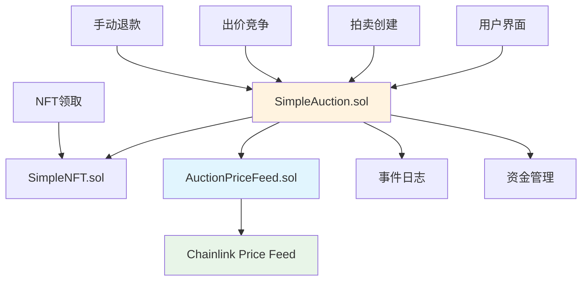

# 设计文档 - NFT拍卖市场

## 概述

基于smartcontractkit/foundry-starter-kit构建的NFT拍卖市场，采用模块化架构设计，充分复用starter kit的Chainlink集成模式和标准项目结构。系统分为三个核心合约：SimpleNFT.sol（NFT管理）、SimpleAuction.sol（拍卖逻辑）、AuctionPriceFeed.sol（价格显示），并在后期扩展为透明代理架构以支持合约升级。

## 与指导文档对齐

### 技术标准（基于foundry-starter-kit）
- **合约组织**：遵循starter kit的单一职责模式，每个合约专注特定功能
- **Chainlink集成**：复用PriceFeedConsumer.sol的AggregatorV3Interface模式
- **目录结构**：保持src/、script/、test/标准布局
- **部署脚本**：扩展starter kit的部署脚本框架

### 项目结构（structure.md）
```
nft-auction-market/
├── src/
│   ├── SimpleNFT.sol           # 基础NFT合约
│   ├── SimpleAuction.sol       # 拍卖逻辑合约
│   ├── AuctionPriceFeed.sol    # 价格显示（复用PriceFeedConsumer模式）
│   └── upgradeable/            # Phase 3: 可升级版本
├── script/
│   ├── DeployNFT.s.sol        # 基于starter kit部署模式
│   ├── DeployAuction.s.sol
│   └── upgrade/               # 升级脚本
├── test/
│   ├── SimpleNFT.t.sol
│   ├── SimpleAuction.t.sol
│   └── integration/           # 集成测试
└── .env                       # 复用用户已配置环境
```

## 代码复用分析

### 可复用的既有组件
- **PriceFeedConsumer.sol**：直接复用AggregatorV3Interface模式和price feed逻辑
- **Foundry配置**：复用foundry.toml的优化配置和依赖管理
- **部署脚本框架**：基于starter kit的script/模板进行扩展
- **测试框架**：利用已有的测试结构和helper函数

### 集成点
- **Chainlink Price Feed**：集成Sepolia网络已配置的ETH/USD feed地址
- **Foundry环境**：连接用户已配置的.env环境变量
- **部署流程**：集成已有的验证和部署脚本流程

## 架构

采用分层模块化架构，遵循单一职责原则和依赖最小化。核心设计基于starter kit的模式，确保与Chainlink生态的标准化集成。

### 模块化设计原则
- **单文件职责**：NFT管理、拍卖逻辑、价格显示严格分离
- **组件隔离**：每个合约独立部署，通过接口交互
- **服务层分离**：Oracle服务、业务逻辑、存储管理分层设计
- **工具模块化**：退款、验证、事件等功能拆分为独立模块



## 组件与接口

### SimpleNFT合约
- **目的：**NFT铸造、转移、授权管理，基础ERC721实现
- **接口：**
  ```solidity
  function mint(address to, string memory uri) external returns (uint256)
  function setApprovalForAll(address operator, bool approved) external
  function ownerOf(uint256 tokenId) external view returns (address)
  ```
- **依赖：**OpenZeppelin ERC721, Ownable
- **复用：**基于标准ERC721模式，无需特殊复用

### SimpleAuction合约
- **目的：**拍卖创建、出价管理、资金结算、状态管理核心逻辑
- **接口：**
  ```solidity
  function createAuction(address nftContract, uint256 tokenId, uint256 duration, uint256 reservePrice) external
  function placeBid(uint256 auctionId) external payable
  function withdrawRefund() external
  function endAuction(uint256 auctionId) external
  function claimNFT(uint256 auctionId) external
  function claimFunds(uint256 auctionId) external
  ```
- **依赖：**ReentrancyGuard, AuctionPriceFeed
- **复用：**基于starter kit的合约组织模式

### AuctionPriceFeed合约
- **目的：**提供ETH到USD价格转换，仅用于显示不影响拍卖逻辑
- **接口：**
  ```solidity
  function getLatestPrice() external view returns (int256)
  function getEthUsdPrice(uint256 ethAmount) external view returns (uint256)
  ```
- **依赖：**Chainlink AggregatorV3Interface
- **复用：**直接基于starter kit的PriceFeedConsumer.sol模式扩展

### 可升级架构组件（Phase 3）
- **ProxyAdmin.sol**：基于OpenZeppelin标准透明代理管理
- **AuctionProxy.sol**：透明代理合约
- **SimpleAuctionUpgradeable.sol**：可升级版本的拍卖合约

## 数据模型

### Auction结构体
```solidity
struct Auction {
    address nftContract;      // NFT合约地址
    uint256 tokenId;          // NFT token ID
    address seller;           // 卖家地址
    uint256 startTime;        // 拍卖开始时间（timestamp）
    uint256 duration;         // 拍卖持续时间（秒）
    uint256 reservePrice;     // 最低价格（wei，ETH单位）
    address highestBidder;    // 当前最高出价者
    uint256 highestBid;       // 当前最高出价（wei）
    bool ended;              // 拍卖是否结束
    bool claimed;            // NFT是否已领取
}
```

### 用户退款映射
```solidity
mapping(address => uint256) public pendingRefunds;  // 用户 => 待退款金额
mapping(uint256 => Auction) public auctions;        // 拍卖ID => 拍卖信息
uint256 public auctionCounter;                       // 拍卖计数器
```

### 价格Feed配置
```solidity
AggregatorV3Interface internal priceFeed;           // Chainlink价格Feed接口
uint256 public constant PLATFORM_FEE = 300;         // 3% = 300/10000
address public platformWallet;                      // 平台收费钱包
```

## 错误处理

### 错误场景
1. **场景1：NFT未授权给拍卖合约**
   - **处理：**检查NFT所有权和授权状态，抛出`NotApprovedError`
   - **用户影响：**前端显示"请先授权NFT给拍卖合约"

2. **场景2：出价金额不足**
   - **处理：**验证出价是否达到最小增幅要求，抛出`BidTooLowError`
   - **用户影响：**显示当前最低出价要求

3. **场景3：拍卖已结束或不存在**
   - **处理：**检查拍卖状态和存在性，抛出`AuctionEndedError`或`AuctionNotFoundError`
   - **用户影响：**显示相应错误提示和可用操作

4. **场景4：Chainlink Price Feed故障**
   - **处理：**捕获Oracle异常，返回默认值或错误标识，但不影响拍卖功能
   - **用户影响：**显示"价格数据暂不可用"但拍卖正常进行

5. **场景5：重入攻击尝试**
   - **处理：**ReentrancyGuard自动阻止，交易回滚
   - **用户影响：**交易失败，gas费用损失

## 测试策略

### 单元测试（基于starter kit测试框架）
- **NFT合约测试**：铸造、转移、授权功能覆盖
- **拍卖逻辑测试**：创建、出价、结束流程覆盖
- **价格Feed测试**：Oracle数据获取和异常处理
- **安全机制测试**：重入攻击防护、权限验证
- **Gas费用测试**：各操作的gas消耗分析

### 集成测试（Sepolia测试网）
- **完整拍卖流程**：从NFT铸造到拍卖完成的端到端测试
- **多用户竞价场景**：模拟真实竞价环境和退款机制
- **Chainlink集成验证**：实际网络环境下的价格Feed调用
- **异常恢复测试**：网络中断、交易失败后的状态恢复

### 端到端测试（用户场景）
- **卖家流程**：NFT授权 → 创建拍卖 → 等待竞价 → 领取资金
- **买家流程**：发现拍卖 → 参与竞价 → 被超越退款 → 赢得领取NFT
- **平台流程**：监控拍卖 → 收取手续费 → 处理异常情况
- **升级流程**：代理部署 → 功能验证 → 升级执行 → 数据完整性验证

### 每阶段Sepolia部署验证
- **Phase 1完成后**：基础NFT和拍卖合约部署，验证核心功能
- **Phase 2完成后**：安全机制验证，压力测试，gas优化确认
- **Phase 3完成后**：代理架构部署，升级流程测试，最终验收